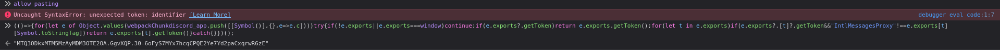

# discord-quest-completer

Automatically completes Discord quests for your account.

> btw sometimes the code may fail; please try again.

## 1. Setup

```bash
pip install -r requirements.txt
```

## 2. Discord Token



Go to F12 or DevTools and console, and put this commands
- allow pasting
- (()=>{for(let e of Object.values(webpackChunkdiscord_app.push([[Symbol()],{},e=>e.c])))try{if(!e.exports||e.exports===window)continue;if(e.exports?.getToken)return e.exports.getToken();for(let t in e.exports)if(e.exports?.[t]?.getToken&&"IntlMessagesProxy"!==e.exports[t][Symbol.toStringTag])return e.exports[t].getToken()}catch{}})();
- btw remove ""
## 3. Usage

```bash
python main.py <YOUR_DISCORD_TOKEN>
# or
DISCORD_TOKEN=your_token python main.py
```

## Supported quest types

- `WATCH_VIDEO` / `WATCH_VIDEO_ON_MOBILE`
- `PLAY_ON_DESKTOP` / `PLAY_ON_XBOX` / `PLAY_ON_PLAYSTATION`
- `PLAY_ACTIVITY`
- `ACHIEVEMENT_IN_ACTIVITY`

> `STREAM_ON_DESKTOP` is not supported — complete those manually in the Discord app.

## Credits

Based on [Discord-Quest-Auto-Completion-Selfbot](https://github.com/aiko-chan-ai/Discord-Quest-Auto-Completion-Selfbot) by [aiko-chan-ai](https://github.com/aiko-chan-ai).